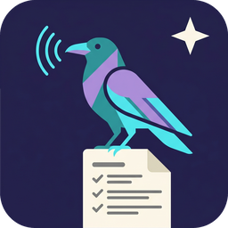
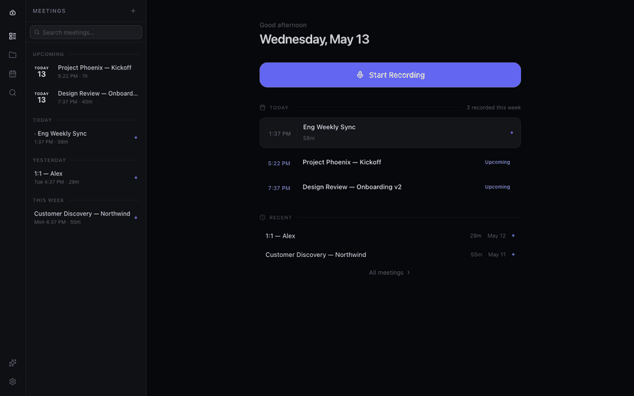

<div align="center">

<a href="https://perchnote.com">
  
</a>

# Perchnote

[**perchnote.com**](https://perchnote.com)

Local-first meeting notes for macOS. It records you, transcribes
everything on your machine with whisper.cpp, then uses the Anthropic API
to turn the transcript into structured notes.

[](./LICENSE)


</div>



The audio, transcripts, and notes all stay on your machine in a local
SQLite database. The only things that ever leave are calls you turn on
yourself: calendar sync, Slack sharing, and the Anthropic API when you
ask for AI notes.

## ✨ Features

- **Recording.** Mic and system audio at the same time, using Core Audio
  process taps. No virtual cable or Loopback license needed.
- **On-device transcription.** whisper.cpp runs locally. Pick from Base,
  Small, Medium, or Large-v3-Turbo in Settings.
- **AI notes.** Your transcript plus a template (decisions, action items,
  sales call, 1:1, etc.) gets summarized by Claude through the
  [Anthropic API](https://docs.anthropic.com/en/api/getting-started).
  Pick Opus 4.7, Sonnet 4.6, or Haiku 4.5 in Settings → AI. It's optional;
  without a key the app still works as a manual notepad.
- **Calendar integration.** Google Calendar OAuth, Microsoft Graph OAuth,
  or any read-only ICS feed. Past events you actually recorded stay in
  the sidebar. Ones you ignored drop out.
- **Search.** Full-text across titles, transcripts, and notes via SQLite
  FTS5.
- **Sharing.** Export to HTML, copy as Markdown, post to a Slack webhook.
- **Speaker diarization.** Optional, AI-assisted.

## 📋 Requirements

- macOS 14 or newer. The Core Audio `CATapDescription` API only exists on
  14+; older versions fall back to mic-only.
- [Node.js](https://nodejs.org/) 20+
- [Rust](https://rustup.rs/) (stable)
- Xcode Command Line Tools (`xcode-select --install`). The Swift
  process-tap helper in `src-tauri/swift/` gets compiled during the build.
- An [Anthropic API key](https://console.anthropic.com/settings/keys) if
  you want AI features. Paste it into Settings → AI. It goes straight into
  the macOS Keychain and never touches the codebase.
- A Whisper model. Download one from Settings → Audio, or install
  `whisper-cpp` via Homebrew and the app will pick up its model directory
  automatically.

## 🚀 Quick start

```sh
git clone https://github.com/<you>/perchnote.git
cd perchnote
npm install
npm run tauri dev
```

First launch walks you through onboarding and grabs a Whisper model.
macOS will ask for Microphone and Screen Recording permission. Yes,
Screen Recording, even though nothing visual is captured. That's the
macOS permission that gates system-audio access.

## 📦 Building a release

```sh
npm run tauri:build
# .app and .dmg end up in src-tauri/target/release/bundle/
```

### Optional: bake in OAuth credentials

If you want Google or Microsoft Calendar to work without each user
registering their own OAuth app, copy `.env.example` to `.env`, fill in
the IDs and secrets, then export them before building:

```sh
set -a; source .env; set +a
npm run tauri:build
```

If you skip this, users can still paste their own client IDs into
Settings → Calendar.

### Regenerating icons

Source raven image lives at `assets/icon-source.png`. To regenerate every
platform size from it after editing:

```sh
npx tauri icon assets/icon-source.png
```

This rewrites everything under `src-tauri/icons/` including the macOS
`.icns`.

## 🔒 Security posture

- **All secrets in the macOS Keychain.** OAuth tokens, OAuth client
  secrets, the Slack webhook URL, and the Anthropic API key all live
  under the `com.perchnote.app` service. SQLite never holds them.
- **Hard CSP.** Production CSP forbids `unsafe-eval` and `unsafe-inline`.
  Full policy is in `src-tauri/tauri.conf.json`.
- **No shell plugin.** Frontend code can't spawn processes or open
  arbitrary URLs. `open_url` is a Rust command with a scheme allow-list.
- **SSRF guard on ICS feeds.** Loopback, link-local, private, CG-NAT,
  and cloud-metadata IPs are rejected. Cleartext HTTP is rejected. 30s
  total + 10s connect timeout. Response body capped at 5 MiB.
- **Path traversal mitigation.** IDs get validated as v4 UUIDs and
  canonicalized against the app data dir before any filesystem op.
- **Prompt-injection mitigation.** Transcripts and user notes are wrapped
  in `<<<TRANSCRIPT>>>` / `<<<USER_NOTES>>>` fences. A system preamble
  tells the model to treat that content as data, not instructions.
- **Pinned `@tanstack/*`** to avoid the Shai-Hulud `react-router`
  compromise window (1.167.68 to 1.167.71). Exact versions in
  `package.json` plus the lockfile.
- **No third-party telemetry.** Outbound HTTP only goes to services you
  connect yourself: Anthropic, Google, Microsoft, Slack, and Hugging
  Face (for model downloads).

Full threat model: [`docs/SECURITY.md`](./docs/SECURITY.md).

## 📁 Project layout

```
assets/                 Brand source (icon-source.png, demo.gif)
src/                    React 19 + TanStack Router frontend
  components/           Per-route components
  lib/                  IPC client, TipTap config, keyword extraction
  stores/               Zustand stores (recording, UI, theme, toast)
src-tauri/
  src/
    audio/              Microphone + system audio capture
    calendar/           Google, Microsoft, ICS sync (plus shared SSRF guard)
    commands/           Tauri command handlers (IPC entry points)
    db/                 SQLite migrations and queries
    ai/                 Anthropic Messages API client and prompt assembly
    transcription/      whisper.cpp invocation
    secrets.rs          Keychain-backed secret storage
  swift/                Core Audio process tap helper (compiled by build.rs)
  icons/                Bundled platform icons (regenerated from assets/)
  capabilities/         Tauri permissions (notification only)
  tauri.conf.json       CSP, bundle metadata
scripts/
  install.sh            Build → /Applications/Perchnote.app
  test.sh               Build + tests + live smoke test
  check-tanstack-pin.mjs  Offline supply-chain pin check
```

## 🛠️ Scripts

| Command              | What it does                                       |
| -------------------- | -------------------------------------------------- |
| `npm run dev`        | Vite frontend only (Tauri backend mocked)          |
| `npm run tauri dev`  | Full Tauri app in dev mode                         |
| `npm run build`      | Type-check and build the frontend                  |
| `npm run tauri:build`| Build and bundle the macOS `.app` and `.dmg`       |
| `npm test`           | Vitest suite                                       |
| `npm run verify:frontend` | Frontend build plus Vitest suite             |
| `npm run verify:rust`| Rust type-check plus library unit tests            |
| `npm run check`      | Frontend and Rust verification without audits      |
| `npm run verify:tanstack-pin` | Offline TanStack router supply-chain pin check |
| `npm run verify:audit` | npm and Rust dep advisory checks                 |
| `npm run verify`     | Full local verification pipeline                   |

## 🤝 Contributing

PRs welcome. Architecture map in [`CONTRIBUTING.md`](./CONTRIBUTING.md).
Before you submit:

1. Run `npm run verify`. It runs frontend checks, Rust checks, and
   dependency audits.
2. For a faster local loop before audits, run `npm run check`.
3. If you add a new outbound destination, update the CSP (for any browser
   calls) and `docs/SECURITY.md`. Rust calls bypass CSP but should still
   be documented.
4. Don't bring back shell-execute or `unsafe-eval`.

## 📄 License

MIT. See [LICENSE](./LICENSE).
